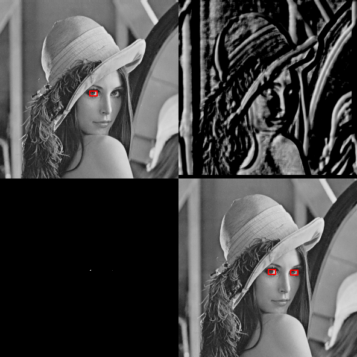

# ndarray-naive-zncc
Calculates the ZNCC between a template and a reference ndarray at a given reference offset.

Implementation based on [CSC320 Lec - Matching Image Patches](http://www.cs.toronto.edu/~guerzhoy/320/lec/patches_filters.pdf).



## Installation

```sh
npm install ndarray-naive-zncc
```

## Usage

```js
const zncc = require('ndarray-naive-zncc');
const pack = require('ndarray-pack');

let result = zncc(pack([
  [0, 0, 0],
  [120, 120, 120],
  [0, 0, 0]
]),
pack([
  [10, 10, 10],
  [140, 140, 140],
  [10, 10, 10]
]));

console.log(result);
```

If desired, offsets can also be given for the reference matrix:

```js
const zncc = require('ndarray-naive-zncc');
const pack = require('ndarray-pack');

let result = zncc(pack([
  [0, 0, 0],
  [120, 120, 120],
  [0, 0, 0]
]),
pack([
  [600, 500, 200, 200],
  [200, 200, 200, 200],
  [300, 10, 10, 10],
  [300, 140, 140, 140],
  [300, 10, 10, 10]
]),
{referenceX: 1, referenceY: 2});

console.log(result);
```

## Example
Run:

```js
npm run example
```

This will generate the results from the preview image of this readme.